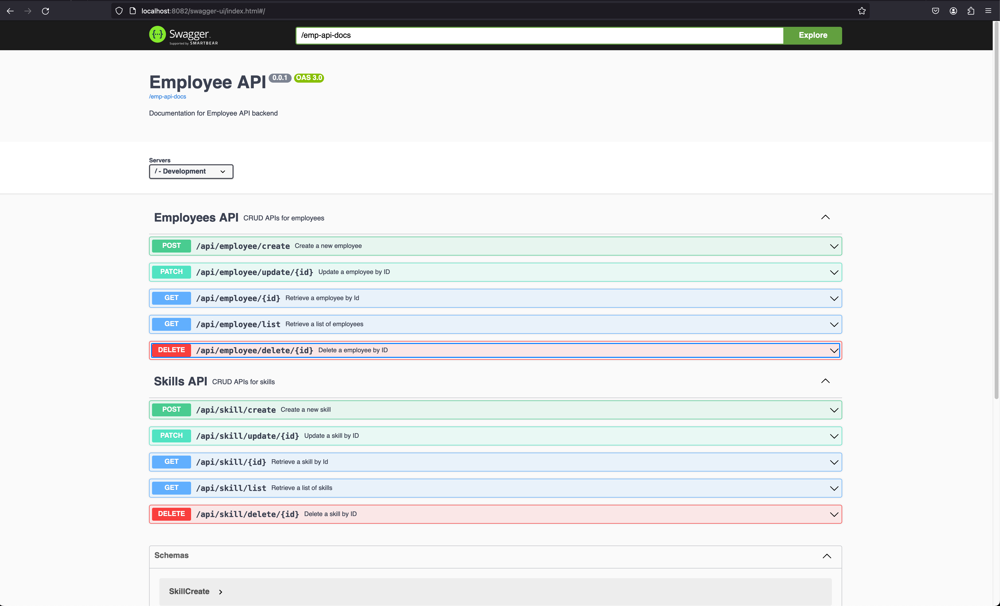

## This is a React frontend for [Employee CRUD backend](https://github.com/ChampIsMe/employee-crud-backend ).

### Features demonstrated:

- [ ] CRUD using Spring boot.(Delete is demonstrated in the API docs)

### Info:
- There is minimal test for demonstration due to more effort required in the resto of the app.

## Requirements & Tools used.

- [ ] Java 21 ```18.2.0```
- [ ] Gradle ```8.6```
- [ ] M1 (Apple Silicon) OS environment.

### How to run

Import the project and run the command `bash deploy_locally.sh` at the root of the project and view at http://localhost:8082/swagger-ui/index.html

#### Allow function creators to enable Mysql function creation:

```mysql
SET GLOBAL log_bin_trust_function_creators = ON;
```
#### Create MYSQL stored function for generating Employee ID

```mysql
USE `empcrud`;
DROP function IF EXISTS `generate_emp_id`;

DELIMITER $$
USE `empcrud`$$
CREATE FUNCTION `generate_emp_id` ()
RETURNS INTEGER
BEGIN
    DECLARE random_number INT;
    REPEAT
        SET random_number = FLOOR(1000 + RAND() * 9000);
    UNTIL NOT EXISTS (
        SELECT * FROM employee WHERE emp_id = random_number
    ) END REPEAT;
    RETURN random_number;
RETURN 1;
END$$

DELIMITER ;
```
